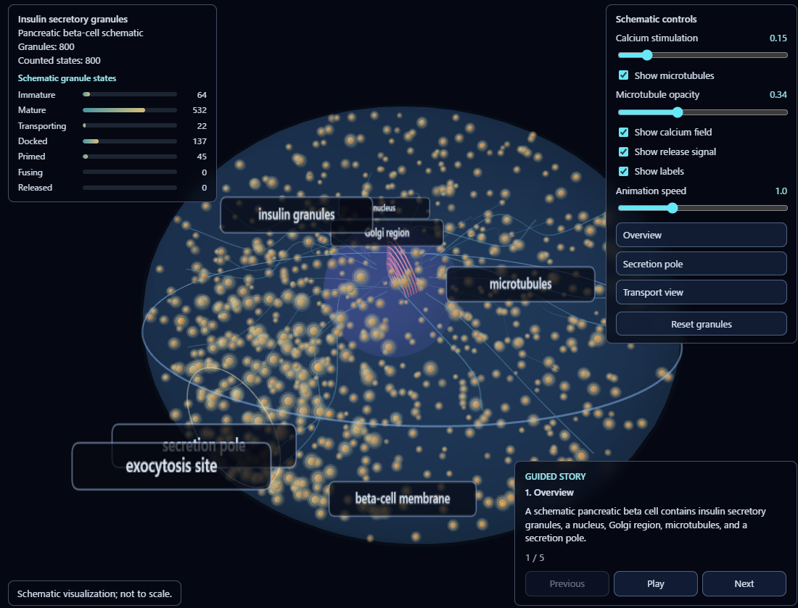

# Insulin Granule Demo

Live demo: https://do-shima.github.io/insulin-granule-demo/

A schematic two-scale Three.js demo of insulin granule behavior and vascular-facing beta-cell polarity.

## Screenshot



## Run Locally

```bash
npm install
npm run dev
npm run build
```

## Biological Narrative

The demo has two visualization modes:

1. Single-cell insulin granule demo: granules mature near the Golgi region, transport along schematic microtubule-like paths, dock and prime near a secretion pole, and produce schematic fusion events.
2. Multicell vascular polarity demo: beta-cell-like ellipsoids are arranged near a schematic capillary network with vascular-facing polarity vectors, contact patches, and schematic release particles.

## Implemented Features

- Guided story mode
- Mode switch between single-cell and multicell demos
- Visual control panel
- Toggleable schematic labels and camera presets
- Selected beta-cell highlight
- Bridge from multicell view to single-cell detail
- Vascular-facing polarity vectors
- Vascular contact patches
- Schematic multicell release particles
- Schematic ER and mitochondria
- Schematic fusion event counter
- Optional Blender-generated multicell backdrop
- Demo-only scientific disclaimer

## Blender Visual Assets

`public/assets/multicell_backdrop.glb` is optional and visual-only. It provides subdued background context for the multicell vascular polarity mode.

The GLB does not drive polarity calculations, vascular contact definitions, release events, secretion behavior, or quantitative biology. If optional GLB assets are missing, the app falls back to the procedural visuals.

## Scientific Caveat

This is a schematic visualization, not a quantitative simulation, and not to scale.

Educational demo only. This visualization does not represent real insulin secretion kinetics, secretion rates, granule densities, or quantitative calcium-dependent dynamics. The animation is not a real secretion model: granule state transitions are illustrative, calcium stimulation changes event probability only for demonstration, displayed fusion events are not secretion rates, and granule densities, timing, and spatial localization are not calibrated to experimental data.

## Technical Stack

- Vite
- TypeScript
- Three.js
- `InstancedMesh` for granule and particle rendering

## Current Limitations

- Not anatomically exact
- Not quantitatively calibrated
- No real microscopy input yet
- Blender assets are optional visual backdrops only

## Future Work

- Additional Blender/GLB visual assets
- Optional performance tuning
- Optional screenshot export
- Optional educational labels refinement
